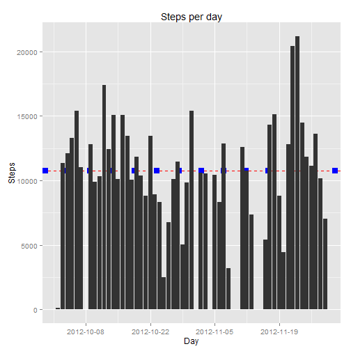
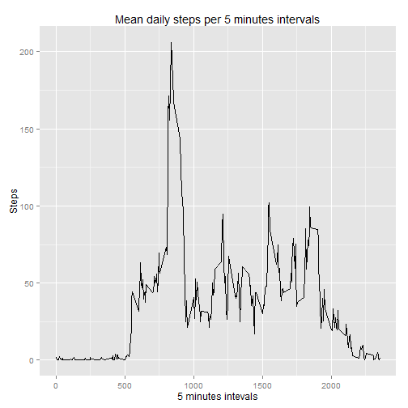
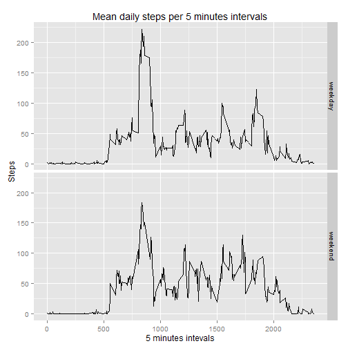

# Reproducible Research: Peer Assessment 1"


## Loading and preprocessing the data


```r
library(plyr)
library(ggplot2)
library(scales)

if ( file.exists("./activity.zip") ) {
    unzip("./activity.zip")
}

activity <- read.csv("./activity.csv", sep=",", head=TRUE)

activity$date <- as.Date(activity$date , "%Y-%m-%d")

activityNan <- na.omit(activity)
```

## What is mean total number of steps taken per day?


```r
stepsbyday <- aggregate(activityNan$steps, list(activityNan$date), FUN=sum )

colnames(stepsbyday) <- c("date", "steps") 

meanStepsPerDay <- mean(stepsbyday$steps)

medianStepsPerDay <- median(stepsbyday$steps)
```

Steps per day mean:


```r
meanStepsPerDay
```

```
## [1] 10766.19
```

Steps per day median:


```r
medianStepsPerDay
```

```
## [1] 10765
```


```r
h <- ggplot(stepsbyday, aes(x=date, y=steps) ) +
     scale_x_date(breaks=date_breaks(width="2 week")) + 
     labs(x = "Day", 
          y = "Steps", 
          title = "Steps per day") +
     geom_hline( yintercept = meanStepsPerDay, 
                 linetype=2,
                 color="red") + 
     geom_hline( yintercept = medianStepsPerDay, 
                 linetype=3,
                 size=3,
                 color="blue") +           
     geom_histogram(stat="identity")
       

print(h)
```



## What is the average daily activity pattern?


```r
stepsbyInterval <- aggregate( activityNan$steps, 
                              list(activityNan$interval ),
                              FUN=mean, na.rm=TRUE)

colnames(stepsbyInterval) <- c("interval", "steps") 

p <- ggplot(stepsbyInterval, aes(x=interval, y=steps) ) +
     labs(x = "5 minutes intevals", 
          y = "Steps", 
          title = "Mean daily steps per 5 minutes intervals") +           
     geom_line()
       

print(p)
```




## Imputing missing values


```r
mValues <- sum(is.na(activity$steps))

fillStepsByInterval <- function(s, i) { 

   if ( !is.na(s) ) 
      value <- s
   else
      value <- stepsbyInterval[ stepsbyInterval$interval == i, "steps"]
     
   if ( is.na(value )) value <- 0
   
   return(value)    

} 

activityFix <- activity
activityFix$steps <- mapply(fillStepsByInterval, activityFix$steps, activityFix$interval)

stepsbydayFix <- aggregate(activityFix$steps, list(activityFix$date), FUN=sum )

colnames(stepsbydayFix) <- c("date", "steps") 

meanStepsPerDayFix <- mean(stepsbydayFix$steps)

medianStepsPerDayFix <- median(stepsbydayFix$steps)
```

## Are there differences in activity patterns between weekdays and weekends?


```r
weekDayOrEnd <- function(d) { 
 
   weekdays_set <- c("Monday", "lunes", 
                     "Tuesday", "martes", 
                     "Wednesday", "miercoles",
                     "Thursday", "jueves",
                     "Friday", "viernes")
 
   day <- weekdays(d)
   
   if ( day %in% weekdays_set )
      return("weekday")
   else
      return("weekend")
}

activityFix$day <- sapply(activityFix$date, FUN=weekDayOrEnd)

avrStepsByWdayAndWend <- aggregate(steps ~ interval + day, data=activityFix, mean)

p <- ggplot(avrStepsByWdayAndWend, aes(x=interval, y=steps) ) +
     labs(x = "5 minutes intevals", 
          y = "Steps", 
          title = "Mean daily steps per 5 minutes intervals") + 
     facet_grid(day ~ .) +       
     geom_line()
       

print(p)
```


